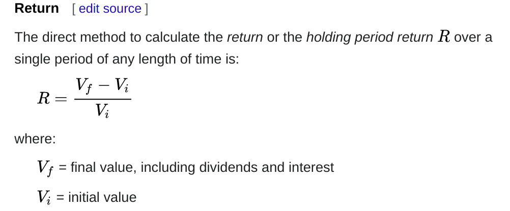
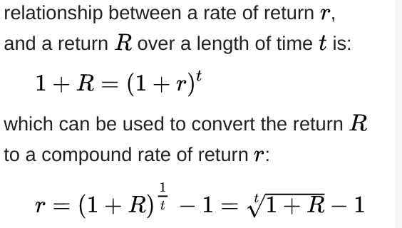

# Fintual Assignment
En este documento encontrarás:
* [las instrucciones de ejecución del código](#Instrucciones-de-ejecución)
* [Supuestos](#supuestos)
* [highlights del código que hace cumplir con los requerimientos del problema](#highlights)

* [Qué cosas se pueden mejorar en el código](#qué-se-puede-mejorar)

## Problem to Solve

Construct a simple Portfolio class that has a collection of Stocks and a "Profit" method that receives 2 dates and returns the profit of the Portfolio between those dates.  

Assume each Stock has a "Price" method that receives a date and returns its price.


Bonus Track: make the Profit method return the "annualized return" of the portfolio between the given dates


# [Instrucciones de ejecución](#Instrucciones-de-ejecución)

### Clonar branch `fintual` del repo
Para clonar sólo la rama que contiene el desafío:
```
git clone -b fintual https://github.com/ihojmanb/job-interviews.git

```
Una vez clonado entramos al directorio `fintual` que contiene todo el código que nos interesa:
```
cd job-interviews/fintual/
```
###  Instalar dependencias
```
pip3 install -r requirements.txt
```

### ejecutar `setup.py` en modo `develop`
```
python3 setup.py develop
```

### ejecutar `stocks.py`
Para ejecutar un ejemplo que muestra un reporte de el *annualized return*:
```
python3 src/stocks/stocks.py

```

### ejecutar tests
Para ejecutar todos los tests:
```
pytest -q -s tests/
```

# [Supuestos](#supuestos)

Para llevar a cabo el desarrollo del problema se tomaron los siguientes supuestos:

1. Se hace uso de una base de datos *dummy*, el archivo `fake_data.json`, para modelar los *Stocks*. Se utilizó el *script*  `fake_stock_data.py` para generar el archivo json.  

`fake_data.json` tiene la siguiente estructura:
```javascript
[
    {
        "ticker": ...,
        "name": ..., 
        "is_etf": ...,
        "exchange": ...,
        "prices": {
            "2019-01-01" : ...
            .
            .
            .
            "2020-12-31" : ...
        }
]

```
Es decir, cada *Stock* está representada por un objeto con información descriptiva y con un objeto de precios, cuyos campos consisten de todas las fechas
entre 2019 y 2020, con un valor aleatorio entre 1 y 10.  

2. En la clase `Portfolio`  se distingue del método `profit` y `annualized_return`, contrario a lo señalado en el enunciado, para hacer énfasis en la implementación del problema en el escenario sin bonus, y con este.

3. El *annualized return* se calculó a partir de las siguientes variables y ecuaciones:
   
     

   todas cortesía de Wikipedia.

4. Para el reporte del *annualized return* en el ejemplo, se adaptó el método para que
    señalara la tasa de retorno acorde a la fracción de tiempo solicitada. Si, por ejemplo,
    se toman dos fechas con una diferencia menor a 31 días, el reporte señala el *annualized return*
    respecto a los días (y no al año). Si la diferencia es mayor a 31 días pero menor a 365, hablaremos  de *rate of return* por mes, y con una diferencia de días mayor a 365, hablaremos de *rate of return* por año.
